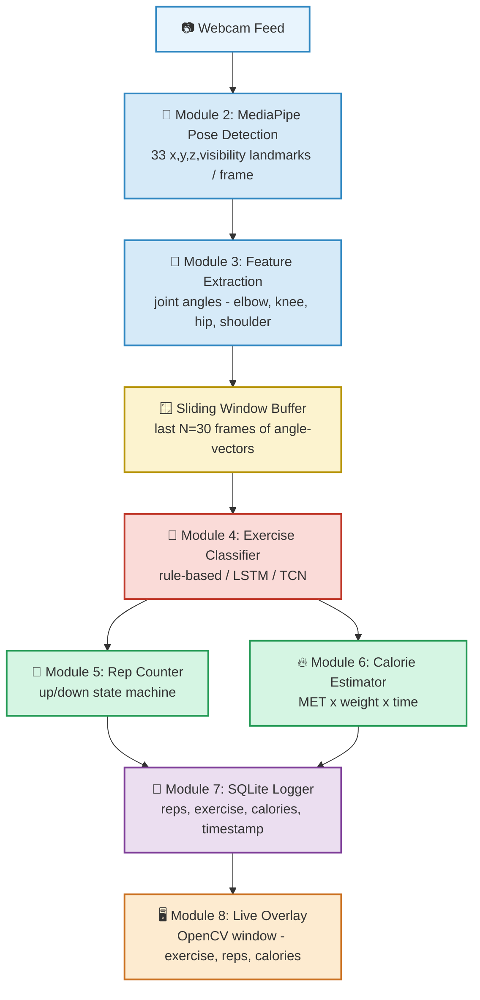

# AI-Powered Fitness Trainer 🏋️‍♂️

Real-time exercise recognition, repetition counting, and calorie estimation using only a standard webcam — no wearables, no sensors.

Built with **MediaPipe Pose** for skeletal tracking and a deep learning classifier (**LSTM / TCN**) for exercise recognition.

----

## 📌 Overview

Most home fitness apps can count reps but give little to no feedback on *what* exercise you're doing or *how much* it's costing you calorie-wise, and they usually depend on manual selection or wearable sensors. This project builds an intelligent virtual trainer that:

- Detects your full-body pose live from a webcam
- Automatically recognizes which exercise you're performing
- Counts repetitions accurately using joint-angle state tracking
- Estimates calories burned in real time
- Logs every session to a local database for history tracking

> **Note:** Posture correction / mistake detection is **out of scope** for this version — see [Future Scope](#-future-scope) below.

---

## 🎯 Objectives

1. Detect full-body pose using a webcam (no wearables required)
2. Automatically recognize the exercise being performed
3. Count repetitions accurately
4. Estimate calories burned based on exercise type and duration
5. Store workout history and session statistics
6. Provide a foundation that can later support posture correction

---

## 🏗️ System Architecture



> This diagram renders automatically on GitHub. If viewing elsewhere, paste the code block into the [Mermaid Live Editor](https://mermaid.live) to preview it.

---

## 🧰 Tech Stack

| Layer | Technology | Purpose |
|---|---|---|
| Pose Estimation | MediaPipe Pose (Tasks API, v0.10.11) | Real-time 33-landmark skeletal tracking |
| Numerical / Angles | NumPy | Joint angle calculation from landmark coordinates |
| Exercise Classifier (baseline) | Rule-based Python logic | Fast, interpretable, no dataset needed |
| Exercise Classifier (advanced) | TensorFlow / Keras — LSTM or TCN | Learns temporal motion patterns from angle sequences |
| Video I/O & Overlay | OpenCV | Webcam capture + on-screen overlay |
| Storage | SQLite | Lightweight local workout history |
| Optional Dashboard | Flask | Serve workout history / progress charts |
| Optional Audio Feedback | pyttsx3 | Offline text-to-speech for rep counts |

---

## ⚙️ Installation

```bash
git clone https://github.com/<your-username>/ai-fitness-trainer.git
cd ai-fitness-trainer

python -m venv venv
source venv/bin/activate      # macOS/Linux
venv\Scripts\activate         # Windows

pip install -r requirements.txt
```

**requirements.txt**
```
opencv-python
mediapipe==0.10.11
numpy
tensorflow
scikit-learn
flask
pyttsx3
```

The MediaPipe pose landmarker model (`pose_landmarker_lite.task`) is downloaded automatically on first run and cached locally — no manual download needed.

---

## ▶️ Usage

### 1. Run the live trainer (rule-based classifier)
```bash
python src/main.py
```
This opens your webcam, overlays the skeleton, and displays the detected exercise, live rep count, and estimated calories burned.

### 2. Collect training data (for the deep learning classifier)
```bash
python collect_dataset.py --label squat
python collect_dataset.py --label bicep_curl
python collect_dataset.py --label pushup
python collect_dataset.py --label lunge
```
Record 30–60 short clips (5–10 sec) per exercise class.

### 3. Preprocess videos into angle sequences
```bash
python preprocess_dataset.py
```

### 4. Train the exercise classifier (LSTM or TCN)
```bash
python train_model.py
```

### 5. Swap in the trained model
In `src/main.py`, replace the rule-based classifier import with `dl_classifier` — the rest of the pipeline (rep counting, calories, logging) requires no changes.

---

## 🧩 Module Breakdown

| # | Module | Description | Difficulty |
|---|---|---|---|
| 1 | Environment Setup | Virtual env + dependency install | 1/10 |
| 2 | Pose Detection | MediaPipe wrapper returning landmarks + skeleton overlay | 3/10 |
| 3 | Feature Engineering | Converts landmarks → joint angles (elbow, knee, hip, shoulder) | 3/10 |
| 4.1 | Exercise Recognition (Baseline) | Rule-based classifier using angle thresholds | 5/10 |
| 4.2 | Exercise Recognition (Advanced) | LSTM/TCN classifier trained on recorded angle sequences | 7/10 |
| 5 | Rep Counter | State machine (up/down transitions) on tracked joint angle | 4/10 |
| 6 | Calorie Estimator | MET-based formula: `Calories = MET × weight(kg) × duration(hr)` | 2/10 |
| 7 | Data Logging | SQLite storage of session history | 2/10 |
| 8 | Integration | Real-time loop tying all modules together | 5/10 |

---

## 📊 Supported Exercises (current scope)

| Exercise | Tracked Angle | MET Value |
|---|---|---|
| Squat | Knee | 5.0 |
| Bicep Curl | Elbow | 3.5 |
| Push-up | Elbow | 8.0 |
| Lunge | Knee | 4.0 |
| Jumping Jack | Knee/Hip | 8.0 |

---

## 🧪 Testing & Evaluation

- Unit-test `calculate_angle()` against hand-computed angles for known coordinate triples
- Validate rule-based thresholds against live webcam performance per exercise
- For the deep learning model: hold out 20% of recorded clips, report accuracy + confusion matrix
- Validate rep counting against manually counted ground-truth reps
- Cross-check calorie output against standard MET-based calculators

---

## 🚀 Future Scope

- **Posture correctness scoring** — flag deviations from ideal joint angle ranges per exercise (e.g., knees caving in, back rounding)
- **Real-time corrective feedback** — audio (`pyttsx3`) or on-screen alerts
- **Progress dashboard** — Flask app charting reps/calories/accuracy over time from workout history
- **Multi-person support**
- **Mobile deployment** — TensorFlow Lite export of the trained classifier

---

## 📄 License

This project is intended for academic/educational purposes.

---

## 🙏 Acknowledgements

- [MediaPipe](https://developers.google.com/mediapipe) for real-time pose estimation
- [TensorFlow/Keras](https://www.tensorflow.org/) for the exercise classification model
